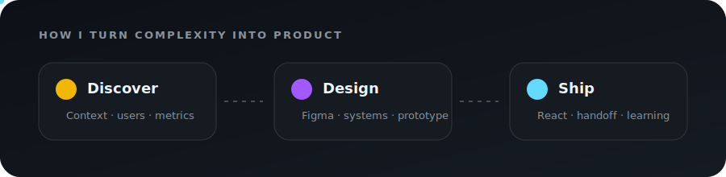

# Diego Suque

Product Designer focused on turning complex business problems into clear, useful and implementation-ready digital products.

## About me

I design end-to-end experiences for complex digital products, especially fintech, identity verification, operational dashboards and B2B platforms.

My work connects user needs, business goals and technical feasibility — from discovery and journey mapping to high-fidelity prototypes, Design Systems, validation and developer handoff. I also use AI to explore alternatives, accelerate prototyping and turn design decisions into functional interfaces.

## From problem to product

  

## What I work with

- Product strategy, UX research and journey mapping
- Complex flows, dashboards and operational products
- UI design, prototyping and usability testing
- Design Systems, accessibility and documentation
- AI-assisted design and functional prototyping
- Close collaboration with Product and Engineering

## Featured projects

| Project | What it demonstrates |
| --- | --- |
| [**Portfolio — Diego Suque**](https://github.com/suquediego/portfolio-diego-suque) | Selected Product Design cases, process and outcomes |
| [**Vera — Identity Verification**](https://github.com/suquediego/vera-case-certta) | End-to-end identity flow, UX decisions and implementation |
| [**Medical Residency MVP**](https://github.com/suquediego/residencia-medica-mvp) | Mobile-first learning experience, metrics and adaptive practice |
| [**CareerOps AI**](https://github.com/suquediego/careerops-ai) | AI applied to a practical product experience |

## Design toolkit

**Design**

**Product**

**Build and AI**

## Beyond the canvas

Product design, code, jiu-jitsu, cooking and an unreasonable amount of **One Piece**.

### Good design makes complexity feel simple.

Open to Product Design opportunities and collaborations.

